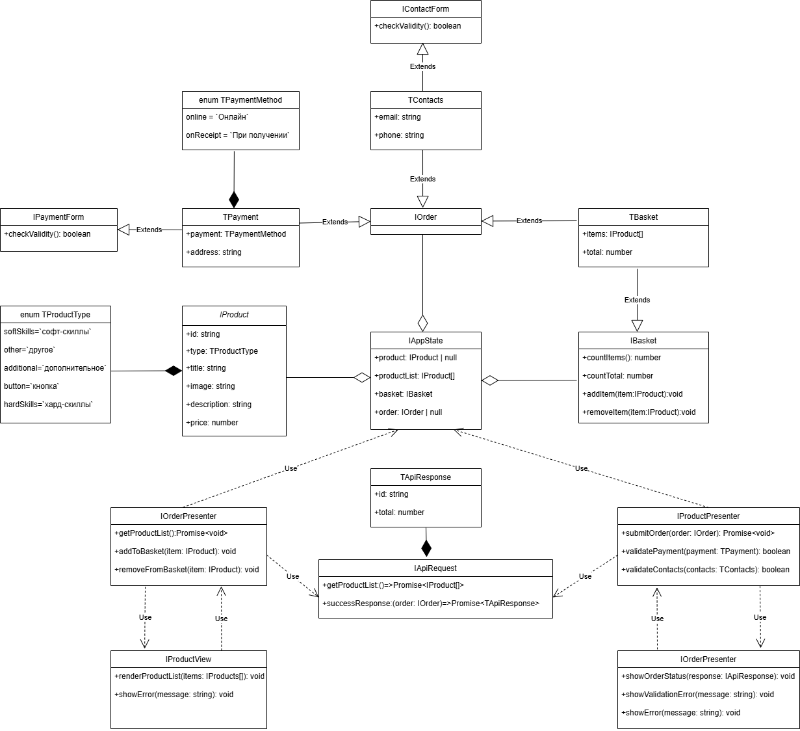

https://github.com/nwctr1nity/web-larek-frontend

# Проектная работа "Веб-ларек"

Стек: HTML, SCSS, TS, Webpack

Структура проекта:
- src/ — исходные файлы проекта
- src/components/ — папка с JS компонентами
- src/components/base/ — папка с базовым кодом

Важные файлы:
- src/pages/index.html — HTML-файл главной страницы
- src/types/index.ts — файл с типами
- src/index.ts — точка входа приложения
- src/scss/styles.scss — корневой файл стилей
- src/utils/constants.ts — файл с константами
- src/utils/utils.ts — файл с утилитами

## Установка и запуск
Для установки и запуска проекта необходимо выполнить команды

```
npm install
npm run start
```

или

```
yarn
yarn start
```
## Сборка

```
npm run build
```

или

```
yarn build
```
## Используемые интерфейсы и типы данных

### index.ts

Список видов товара

```
export const enum TProductType {
    softSkill = `софт-скилл`,
    other = `другое`,
    additional = `дополнительное`,
    button = `кнопка`,
    hardSkill = `хард-скилл`
}
```

Список способов оплаты
```
export const enum TPaymentMethod {
    online = `Онлайн`,
    onReceipt = `При получении`
}
```

Тип корзины товаров
```
export type TBasket = {
    items: IProduct[];
	total: number;
}
```
Интерфейс корзины товаров
```
export interface IBasket extends TBasket {
    countItems(): number;
	countTotal(): number;
    
    addItem(item: IProduct): void;
	removeItem(item: IProduct): void;
}
```

Тип формы оплаты и адреса
```
export type TPayment = {
    payment: TPaymentMethod;
    address: string;
}
```
Интерфейс формы оплаты и адреса
```
export interface IPaymentForm extends TPayment {
    checkValidity(): boolean;
}
```

Тип формы контактов
```
export type TContacts = {
    email: string;
    phone: string;
}
```
Интерфейс формы контактов
```
export interface IContactsForm extends TContacts {
    checkValidity(): boolean;
}
```

Интерфейс продукта, получаемого с сервера
```
export interface IProduct {
    id: string;
    type: TProductType;
    title: string;
    image: string;
    description: string;
    price: number;
}
```
Интейфейс отправляемого на сервер заказа
```
export interface IOrder extends TPayment, TContacts, TBasket {}
```

### api.ts

Тип ответа с сервера
```
export type TApiResponse = {
    id: string;
    total: number;
}
```

Интерфейс запроса на сервер
```
export interface IApiRequest {
    getProductList:() => Promise<IProduct[]>;
    successResponse:(order: IOrder) => Promise<TApiResponse>
}
```

### model.ts

Интерфейс модели
```
export interface IAppState {
    product: IProduct | null;
    productList: IProduct[];
    basket: IBasket;
    order: IOrder | null;
}
```

### presenter.ts

Интерфейс для управления отображением
```
export interface IProductPresenter {
    getProductList(): Promise<void>;
    addToBasket(item: IProduct): void;
    removeFromBasket(item: IProduct): void;
}
```

Интерфейс для заказа и валидации
```
export interface IOrderPresenter {
    submitOrder(order: IOrder): Promise<void>;
    validatePayment(payment: TPayment): boolean;
    validateContacts(contacts: TContacts): boolean;
}
```

### view.ts

Интерфейс для рендера товаров
```
export interface IProductView {
    renderProductList(items: IProduct[]): void;
    showError(message: string): void;
}
```

Интерфейс отображения валидации
```
export interface IOrderView {
    showOrderStatus(response: TApiResponse): void;
    showValidationError(message: string): void;
    showError(message: string): void;
}
```

## Архитектура приложения

Соответствуя принципу MVP-паттерна, основная идея заключается в добавлении связующего юнита между моделью и отображением.

